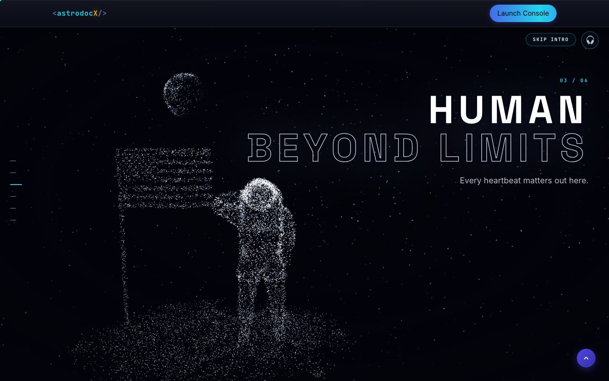
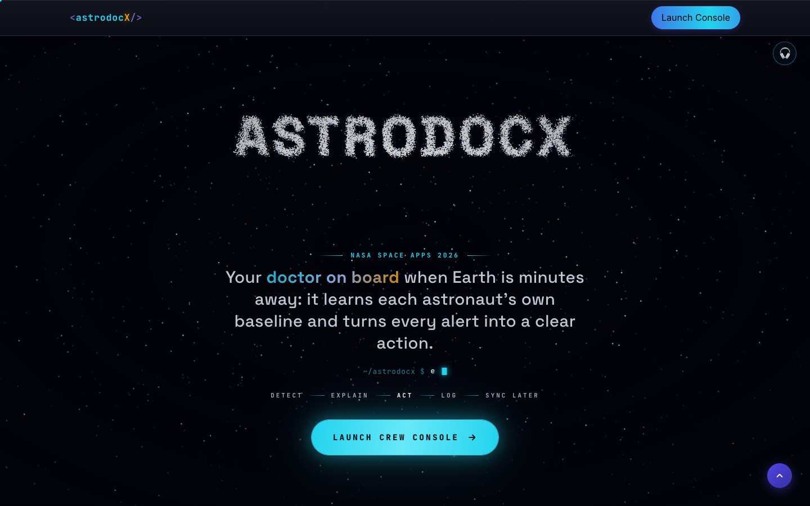
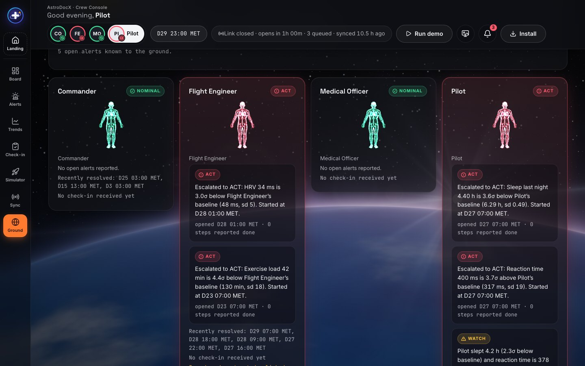

# AstroDocX

**Astronaut + Doctor + X** — an offline-first health co-pilot for astronauts on long-duration missions.

> NASA Space Apps Challenge 2026 · Challenge: *Create Health Monitoring Software for Astronauts on Space Missions*
> Team AstroDocX · Dhaka, Bangladesh


## The problem
Long-duration missions expose astronauts to the five spaceflight hazards NASA groups as **RIDGE**:

- **R**adiation
- **I**solation and confinement
- **D**istance from Earth
- **G**ravity (altered)
- Hostile, closed **E**nvironments

These can bring immune changes, bone and muscle loss, cardiovascular events and behavioral health problems. Beyond the Moon, a message to Earth can take minutes each way, so the crew has to spot these changes in themselves and decide what to do.

## Our solution
AstroDocX learns each astronaut's **personal baseline**, spots drift early, and turns every alert into a **clear action** the crew can take on their own:

**Detect → Explain → Act → Log → Sync later**

| Area | What the Crew Console really does |
|---|---|
| Personal baselines | Learns each astronaut's own normal for 11 metrics (HR, HRV, SpO₂, sleep, exercise, reaction time, mood, CO₂, cabin temperature, noise, radiation dose) with Welford + EWMA; it only learns while nominal, so slow drift is not "learned away" |
| Detection | Smoothed z-scores plus cited absolute limits (NASA-STD-3001 CO₂ and dose), persistence (2–3 readings in a row) and two-signal rules (sleep + reaction); Nominal / Watch / Act with hysteresis |
| Explainable alerts | Each alert says what changed, by how much, against whose baseline and since when, and links the published NASA evidence behind it (OSDR studies with DOIs, Human Research Program reports on NTRS); context, never a diagnosis |
| Action cards | Checkable countermeasure steps with progress and Done; open → escalate → ease → resolve lifecycle, all logged |
| Status Board | Five RIDGE tiles, crew readiness score, crew overview, next action, live vitals strip (ECG-style waves, heart pulse) |
| Health Twin (console) | A 3D particle body (the same baked human as the landing page) turning gently: the heart beats with the live ECG, a pulse runs down the arteries, and each hazard colours its own part (brain, lungs, legs, skin, transmitter arm) amber or red |
| Trends | 11 charts with the personal baseline band, alert markers, 24 h / 7 d / 30 d |
| Daily Check-in | Mood, sleep quality, hours slept, 8 symptom chips and a 5-tap reaction test (PVT-style); symptoms and sleep quality raise alerts |
| Mission Simulator | Mission clock, fast-forward, 4 injectable scenarios (solar event, CO₂ fault, insomnia, deconditioning); watch the engine react |
| Ground Sync | Delay-tolerant outbox: link windows, 12-minute delay, blackout, auto-sync, CSV log export |
| Ground View | Flight-surgeon view rebuilt only from synced entries (shows what Earth knows, and when); each crew card shows the 3D body in its status colour |
| Platform | Offline-first installable PWA, IndexedDB on the device, 4-crew 30-day demo mission preloaded |

**Not built yet (Roadmap):** wearable sensor integration, a real Supabase ground backend with proper policies, vision/SANS self-tests, blood pressure, bone density, a multi-device ground station.

> **Status:** the landing page and the **Crew Console** (`app/`) are built and run the full loop on synthetic data. See [`plan.md`](plan.md) for the build log. AstroDocX is a prototype, **not a medical device**; all thresholds not cited in the code are illustrative.

## Screenshots
**Landing page:** one scroll-driven journey made of the same 24,000 particles: stardust, a planet, an astronaut saluting the flag on the Moon, Orion, a relay satellite and Earth, which then becomes the Health Twin and finally the AstroDocX wordmark.

| Intro | Crew: on the Moon |
|---|---|
|  |  |

| Health Twin | AstroDocX |
|---|---|
|  |  |

**Crew Console** (synthetic demo data, Pilot selected)


| Alerts | Trends |
|---|---|
|  |  |

| Check-in | Mission control |
|---|---|
|  |  |

| Ground Sync | Ground View |
|---|---|
|  |  |

The live waves on the board (ECG, pulse oximeter, breathing) are **simulated telemetry** built around the latest real readings; they never change alerts.

## Try it
- **Health Twin:** scroll through the section. The scan runs head to feet, six system panels appear, Crew Readiness counts up, then the Pilot's real Act alert from the demo mission appears as an action card. Panel values are the demo mission's latest readings.
- **Run demo (Crew Console):** press *Run demo* in the top bar to inject a CO₂ scrubber fault and watch the board, twin and alerts react (about 20 s); *Reset demo* restores the mission data.
- **Mission Simulator (Crew Console, `/app/simulator`):** inject a scenario (solar particle event, CO₂ scrubber fault, insomnia streak, skipped exercise) for one crew member or the whole crew, then tick the action-card steps on Alerts and sync the log from Ground Sync in the next link window.

## Links
- **Landing page:** https://astrodocx.vercel.app
- **Crew Console:** https://astrodocx.vercel.app/app/
- **Video:** https://youtu.be/RW1KRrJToUs
- **Repo:** https://github.com/A-42-018/AstroDocX

## Run locally
**Crew Console** (needs Node 22):

```bash
cd app
npm install
npm run dev      # http://localhost:5173/app/
npm test         # 180+ tests (engine, UI, DB)
npm run build && npm run preview   # production build with the service worker, to test install and offline
```

**Landing page** is a static site with no build step.

```bash
cd landing
python3 -m http.server 8000
# open http://localhost:8000
```

## Optional: real ground server (Supabase)
By default Ground Sync is simulated and nothing leaves the device. To upload synced log entries to a real server, create a Supabase project, run [`docs/supabase.sql`](docs/supabase.sql), copy `app/.env.example` to `app/.env.local` and fill in `VITE_SUPABASE_URL` and `VITE_SUPABASE_ANON_KEY`, then rebuild. Uploads happen only in link windows; a failed upload keeps entries queued like a blackout. The Ground View then reads from the server, so a flight surgeon can open `/app/ground` on another computer. **The provided policies are demo-grade (anonymous insert and read) and only suitable for synthetic data**; see the notes in the SQL file.

## Record the project video (tour mode)
Open the landing page with `?tour=1` (for example `http://localhost:8000/?tour=1`) and it plays the journey by itself, pausing on every scene and Health Twin stage, so a screen recording is smooth. The cursor and back-to-top button are hidden. Options: `&speed=1.25` (faster), `&delay=5` (lead-in seconds). Keys: Space pause, R restart, Esc stop; any mouse wheel or touch also stops it. Check the Space Apps video length rules; hold times per scene are `tour` in `landing/universe/scenes.js`.

## Deploy (Netlify)
`netlify.toml` builds the console (`cd app && npm ci && npm run build`), copies it to `landing/app/`, and publishes `landing/`. So one site serves the landing page at `/` and the Crew Console PWA at `/app/` (with an SPA fallback). Connect the repo in Netlify and deploy.

## Deploy (Vercel)
`vercel.json` does the same job: it installs and builds the console in `app/`, copies it to `landing/app/`, and serves `landing/` as the output, with the `/app/*` SPA fallback, the same security headers and no-cache for `sw.js`. Import the repo in Vercel with the root directory left at the repo root and the framework preset set to **Other**; set **Node.js 22.x** in Project Settings, General. No environment variables are needed (the Ground Server variables in `app/` are optional).

## Tech
- Landing page: HTML, CSS and vanilla JavaScript; one WebGL particle system ([Three.js r128](https://threejs.org/)) for the whole page, Health Twin included; [GSAP 3.12 + ScrollTrigger](https://gsap.com/) for the pinned scroll
- 3D shapes are baked offline into small point clouds by dependency-free Node scripts in `tools/`: the Crew scene from the NASA Z2 spacesuit model (right arm re-posed into a salute), the human body carved from a 360° turntable video (visual hull)
- Crew Console: React + TypeScript + Vite PWA, IndexedDB (Dexie), Zustand, Recharts, Vitest; its Health Twin draws the same baked body with plain WebGL (simulated ground sync; Supabase optional)

## Project structure
```
AstroDocX/
├── landing/        # landing page (static)
│   ├── index.html
│   ├── styles.css
│   ├── script.js   # nav, typewriter, back-to-top
│   ├── tour.js     # ?tour=1 self-scrolling video mode
│   ├── universe/   # the particle journey: one canvas for intro -> Health Twin -> AstroDocX
│   │               #   scenes.js (copy + chapter lengths), engine.js (8 shapes), universe.js (director),
│   │               #   health-twin.js, reveal.js (chapter UI), stars.js, camera.js, fx.js, sound.js, universe.css
│   │   └── targets/ # baked point clouds: astronaut.bin (Crew scene), body.bin + body.json (Health Twin)
│   ├── anatomy3d.js # opt-in 3D anatomy viewer (Sketchfab)
│   ├── fonts/
│   └── assets/     # feature mockups, og-image
├── app/            # Crew Console PWA (React + TypeScript + Vite)
├── tools/          # particle bakers: bake-moon.mjs, bake-body.mjs, bake-particles.mjs (+ undraco.mjs)
├── docs/           # design references, screenshots, AI_USE.md
├── plan.md         # roadmap
└── netlify.toml
```

## Use of AI
No AI runs inside the product: every number, alert and explanation comes from tested, deterministic code. Claude Code helped write the code, and Tripo Studio generated the anatomy render behind the Health Twin body. Tools, prompts and the team's own work: [`docs/AI_USE.md`](docs/AI_USE.md).

## Data & references
- [NASA Human Research Program](https://www.nasa.gov/hrp/): the five hazards of human spaceflight (RIDGE)
- [NASA Open Science Data Repository (OSDR)](https://osdr.nasa.gov/): studies cited in the alerts: [OSD-484](https://osdr.nasa.gov/bio/repo/data/studies/OSD-484) (heart), [OSD-942](https://osdr.nasa.gov/bio/repo/data/studies/OSD-942) (exercise and bed rest), [OSD-993](https://osdr.nasa.gov/bio/repo/data/studies/OSD-993) (space radiation)
- [NASA Technical Reports Server (NTRS)](https://ntrs.nasa.gov/): Human Research Program reports cited in the alerts: cardiac rhythm ([20170005625](https://ntrs.nasa.gov/citations/20170005625)), sleep loss and performance ([20160003864](https://ntrs.nasa.gov/citations/20160003864)), behavioural health ([20160004365](https://ntrs.nasa.gov/citations/20160004365)), CO₂ and headaches on the ISS ([20160012725](https://ntrs.nasa.gov/citations/20160012725))
- [NASA Twins Study](https://www.nasa.gov/twins-study/)
- [PhysioNet](https://physionet.org/): public physiological signals (ECG / HRV)

Landing-page numbers (the Health Twin panels and Crew Readiness) come from the console's seeded demo mission (synthetic data). Only the CO₂ and dose limits are cited (NASA-STD-3001).

## Credits
The visual theme (nebula, 3D astronaut, scroll system) is adapted from team lead Alif Mahmud's own portfolio template.

3D sources: the Crew scene's astronaut is the NASA Z2 spacesuit from [NASA 3D Resources](https://science.nasa.gov/3d-resources/); the Health Twin body is carved from a turntable render the team made in Tripo Studio. Details and licences: [`landing/universe/targets/README.md`](landing/universe/targets/README.md).

## License
[MIT](LICENSE)
