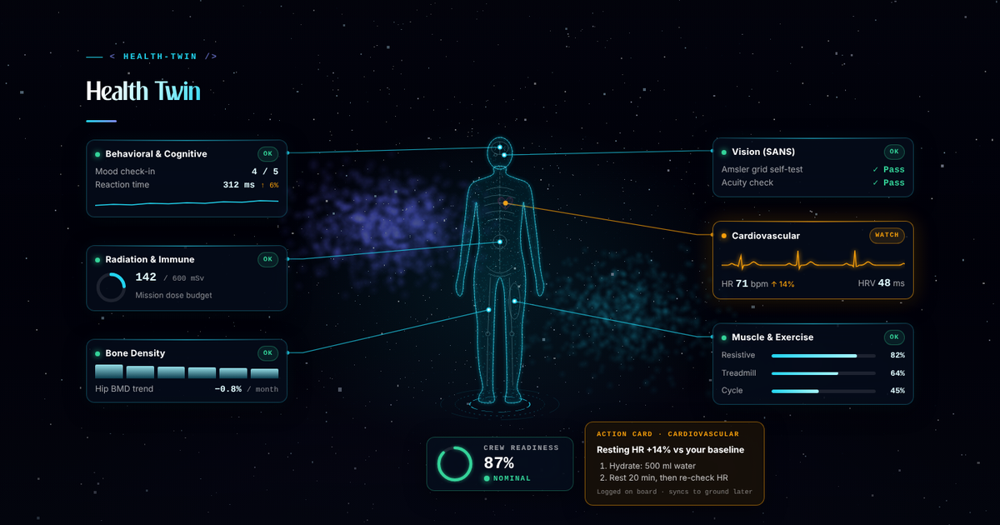
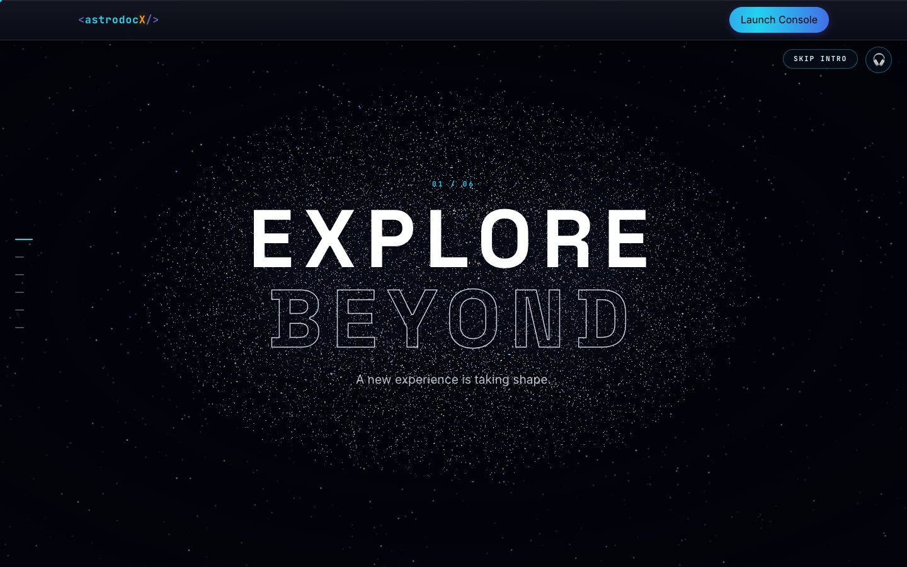
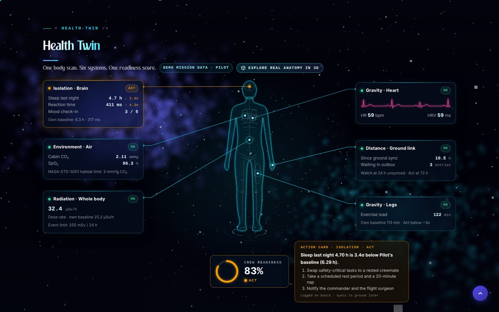
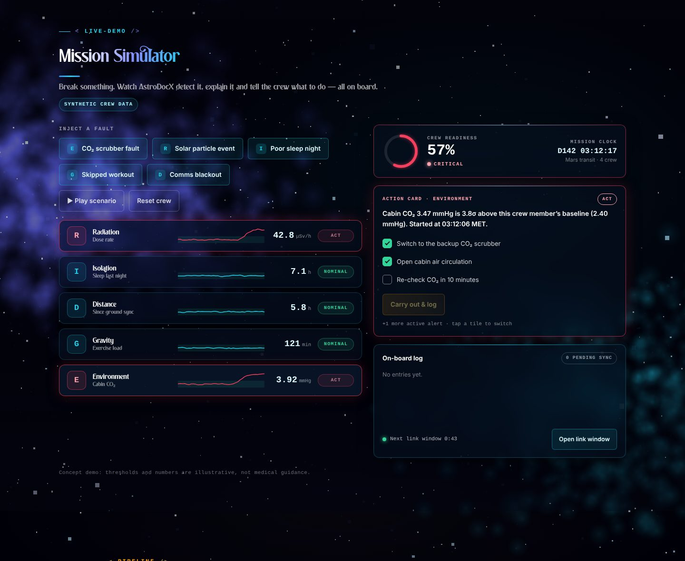
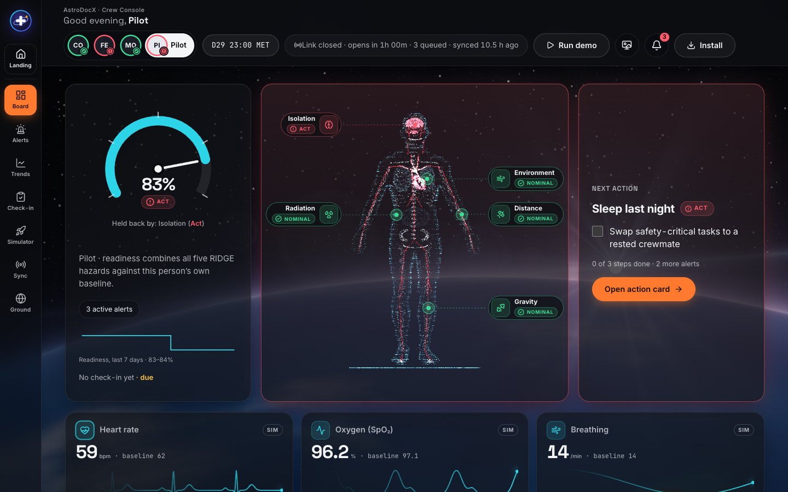
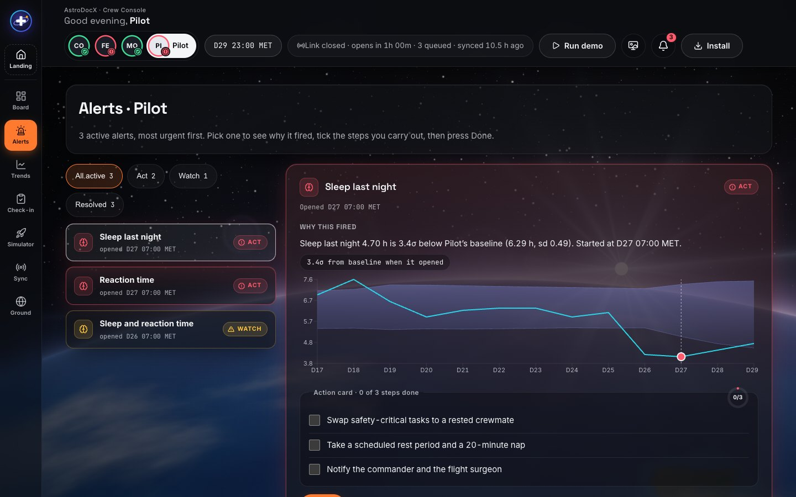
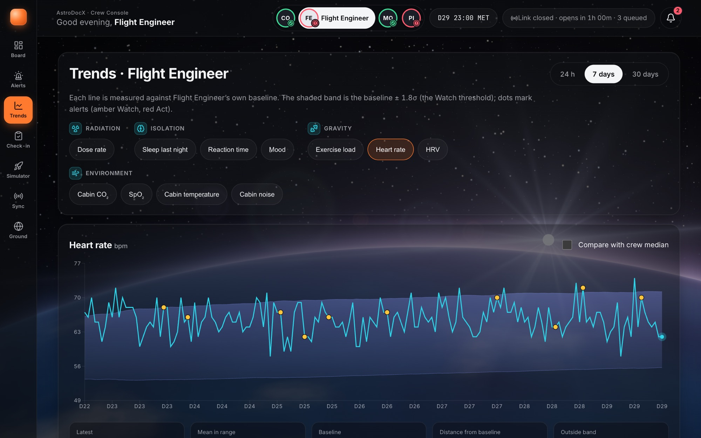
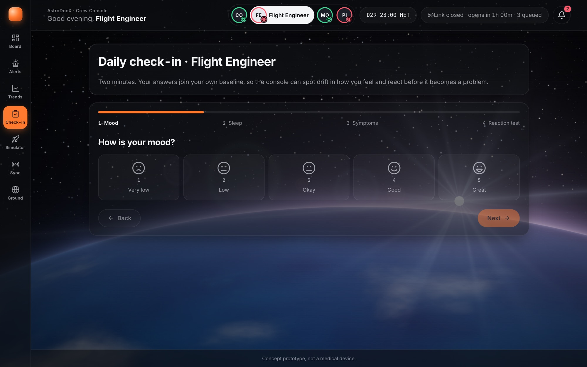
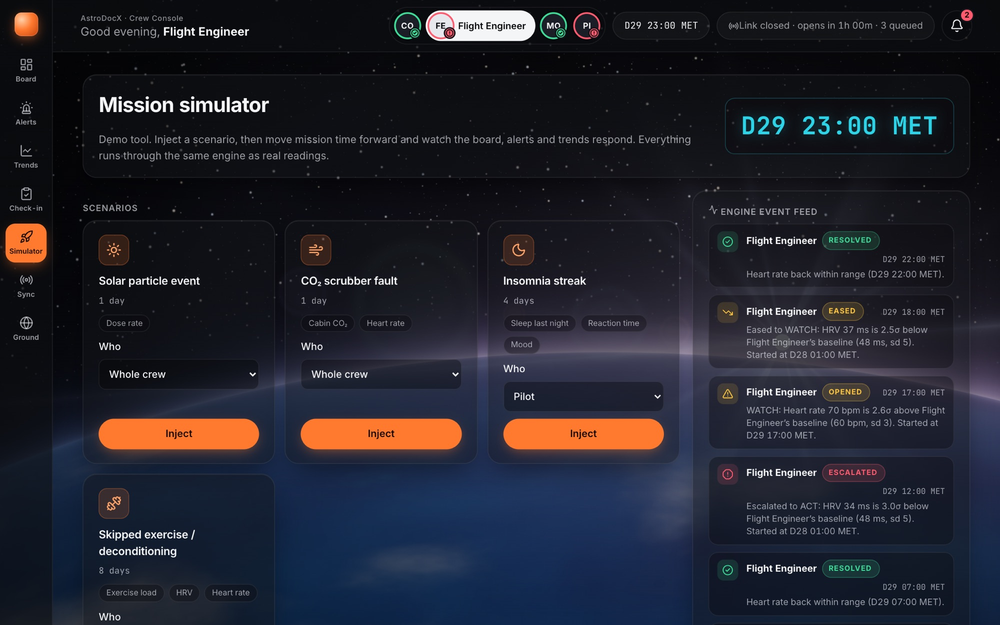
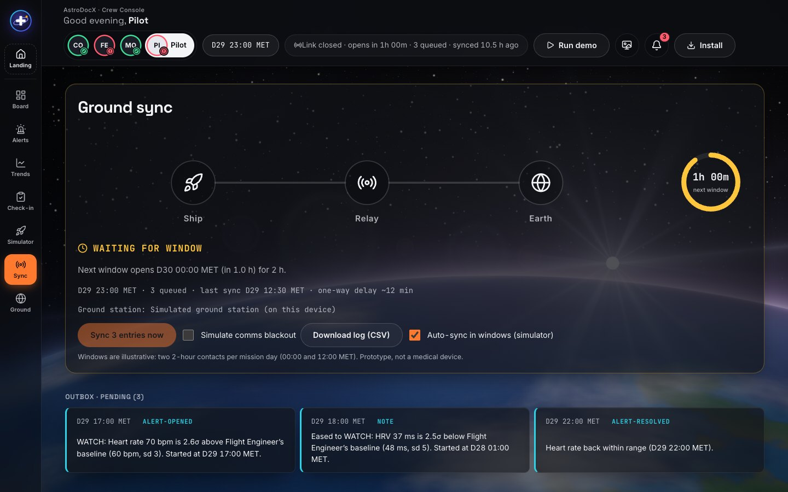

# AstroDocX

**Astronaut + Doctor + X** — an offline-first health co-pilot for astronauts on long-duration missions.

> NASA Space Apps Challenge 2026 · Challenge: *Create Health Monitoring Software for Astronauts on Space Missions*
> Team AstroDocX · Dhaka, Bangladesh



## The problem
Long-duration missions expose astronauts to the five spaceflight hazards NASA groups as **RIDGE**:

- **R**adiation
- **I**solation and confinement
- **D**istance from Earth
- **G**ravity (altered)
- Hostile, closed **E**nvironments

These can bring immune changes, bone and muscle loss, cardiovascular events and behavioral health problems. Beyond the Moon, a message to Earth can take minutes each way, so the crew has to spot these changes in themselves and decide what to do.

## Our solution
AstroDocX learns each astronaut's **personal baseline**, spots drift early, and turns every alert into a **clear action** the crew can take on their own:

**Detect → Explain → Act → Log → Sync later**

| Area | What the Crew Console really does |
|---|---|
| Personal baselines | Learns each astronaut's own normal for 11 metrics (HR, HRV, SpO₂, sleep, exercise, reaction time, mood, CO₂, cabin temperature, noise, radiation dose) with Welford + EWMA; it only learns while nominal, so slow drift is not "learned away" |
| Detection | Smoothed z-scores plus cited absolute limits (NASA-STD-3001 CO₂ and dose), persistence (2–3 readings in a row) and two-signal rules (sleep + reaction); Nominal / Watch / Act with hysteresis |
| Explainable alerts | Each alert says what changed, by how much, against whose baseline and since when |
| Action cards | Checkable countermeasure steps with progress and Done; open → escalate → ease → resolve lifecycle, all logged |
| Status Board | Five RIDGE tiles, crew readiness score, crew overview, next action, live vitals strip (ECG-style waves, heart pulse) |
| Health Twin (console) | Anatomical hologram: a live heart beating with the ECG; organs and bones take their hazard status |
| Trends | 11 charts with the personal baseline band, alert markers, 24 h / 7 d / 30 d |
| Daily Check-in | Mood, sleep quality, hours slept, 8 symptom chips and a 5-tap reaction test (PVT-style); symptoms and sleep quality raise alerts |
| Mission Simulator | Mission clock, fast-forward, 4 injectable scenarios (solar event, CO₂ fault, insomnia, deconditioning); watch the engine react |
| Ground Sync | Delay-tolerant outbox: link windows, 12-minute delay, blackout, auto-sync, CSV log export |
| Ground View | Flight-surgeon view rebuilt only from synced entries (shows what Earth knows, and when) |
| Platform | Offline-first installable PWA, IndexedDB on the device, 4-crew 30-day demo mission preloaded |

**Not built yet (Roadmap):** wearable sensor integration, a real Supabase ground backend with proper policies, vision/SANS self-tests, blood pressure, bone density, a multi-device ground station.

> **Status:** the landing page and the **Crew Console** (`app/`) are built and run the full loop on synthetic data. See [`plan.md`](plan.md) for the build log. AstroDocX is a prototype, **not a medical device**; all thresholds not cited in the code are illustrative.

## Screenshots
**Landing page**

| Hero | Health Twin | Mission Simulator |
|---|---|---|
|  |  |  |

**Crew Console** (synthetic demo data, Pilot selected)



| Alerts | Trends |
|---|---|
|  |  |

| Check-in | Mission control |
|---|---|
|  |  |



The live waves on the board (ECG, pulse oximeter, breathing) are **simulated telemetry** built around the latest real readings; they never change alerts.

## Try it
- **Health Twin:** scroll through the section. The scan runs head to feet, six system panels appear, Crew Readiness counts up, then the Pilot's real Act alert from the demo mission appears as an action card. Panel values are the demo mission's latest readings.
- **Mission Simulator (Live Demo):** inject a fault (CO₂ scrubber fault, solar particle event, insomnia streak, skipped exercise, link blackout) or press *Play scenario*. Tick the action-card steps, press *Carry out & log*, then open the ground link window to sync the log.

## Links
- **Landing page:** https://astrodocx.netlify.app
- **Crew Console:** https://astrodocx.netlify.app/app/
- **Video:** _add video URL_
- **Repo:** https://github.com/A-42-018/AstroDocX

## Run locally
**Crew Console** (needs Node 22):

```bash
cd app
npm install
npm run dev      # http://localhost:5173/app/
npm test         # 100+ tests (engine, UI, DB)
npm run build && npm run preview   # production build with the service worker, to test install and offline
```

**Landing page** is a static site with no build step.

```bash
cd landing
python3 -m http.server 8000
# open http://localhost:8000
```

## Optional: real ground server (Supabase)
By default Ground Sync is simulated and nothing leaves the device. To upload synced log entries to a real server, create a Supabase project, run [`docs/supabase.sql`](docs/supabase.sql), copy `app/.env.example` to `app/.env.local` and fill in `VITE_SUPABASE_URL` and `VITE_SUPABASE_ANON_KEY`, then rebuild. Uploads happen only in link windows; a failed upload keeps entries queued like a blackout. The Ground View then reads from the server, so a flight surgeon can open `/app/ground` on another computer. **The provided policies are demo-grade (anonymous insert and read) and only suitable for synthetic data**; see the notes in the SQL file.

## Record the project video (tour mode)
Open the landing page with `?tour=1` (for example `http://localhost:8000/?tour=1`) and it scrolls itself from hero to footer at a steady pace, so a screen recording is smooth. The cursor and back-to-top button are hidden, and the Live Demo's *Play scenario* starts on its own. Options: `&speed=1.25` (faster), `&delay=5` (lead-in seconds). Keys: Space pause, R restart, Esc stop; any mouse wheel or touch also stops it. Default run is roughly 3 to 4 minutes; check the Space Apps video length rules and tune `PLAN` in `landing/tour.js`.

## Deploy (Netlify)
`netlify.toml` builds the console (`cd app && npm ci && npm run build`), copies it to `landing/app/`, and publishes `landing/`. So one site serves the landing page at `/` and the Crew Console PWA at `/app/` (with an SPA fallback). Connect the repo in Netlify and deploy.

## Deploy (Vercel)
`vercel.json` does the same job: it installs and builds the console in `app/`, copies it to `landing/app/`, and serves `landing/` as the output, with the `/app/*` SPA fallback, the same security headers and no-cache for `sw.js`. Import the repo in Vercel with the root directory left at the repo root and the framework preset set to **Other**; set **Node.js 22.x** in Project Settings, General. No environment variables are needed (the Ground Server variables in `app/` are optional). The `og:image` and canonical URL in `landing/index.html` still name the Netlify site; update them to the Vercel URL if that becomes the main one.

## Tech
- HTML, CSS and vanilla JavaScript
- [Three.js r128](https://threejs.org/) for the nebula and 3D astronaut
- [GSAP 3.12 + ScrollTrigger](https://gsap.com/) for scroll animation
- One WebGL particle system (three.js) for the whole landing page, Health Twin included
- Crew Console: React + TypeScript + Vite PWA, IndexedDB (Dexie), Zustand, Recharts, Vitest (simulated ground sync; Supabase is a stretch goal)

## Project structure
```
AstroDocX/
├── landing/        # landing page (static)
│   ├── index.html
│   ├── styles.css
│   ├── script.js   # nav, typewriter, back-to-top
│   ├── tour.js     # ?tour=1 self-scrolling video mode
│   ├── universe/   # the particle journey: one canvas for intro -> Health Twin -> AstroDocX
│   │               #   scenes.js (copy + chapter lengths), engine.js (8 shapes), universe.js (director),
│   │               #   health-twin.js, reveal.js (chapter UI), stars.js, camera.js, fx.js, universe.css
│   ├── fonts/
│   └── assets/     # feature mockups, og-image
├── app/            # Crew Console PWA (React + TypeScript + Vite)
├── docs/           # design references + screenshots
├── plan.md         # roadmap
└── netlify.toml
```

## Data & references
- [NASA Human Research Program](https://www.nasa.gov/hrp/): the five hazards of human spaceflight (RIDGE)
- [NASA Open Science Data Repository (OSDR)](https://osdr.nasa.gov/)
- [NASA Twins Study](https://www.nasa.gov/twins-study/)
- [PhysioNet](https://physionet.org/): public physiological signals (ECG / HRV)

Landing-page numbers come from the console's seeded demo mission (synthetic data); the marquee values and the Live Demo are illustrative. Only the CO₂ and dose limits are cited (NASA-STD-3001).

## Credits
The visual theme (nebula, 3D astronaut, scroll system) is adapted from team lead Alif Mahmud's own portfolio template.

## License
[MIT](LICENSE)
